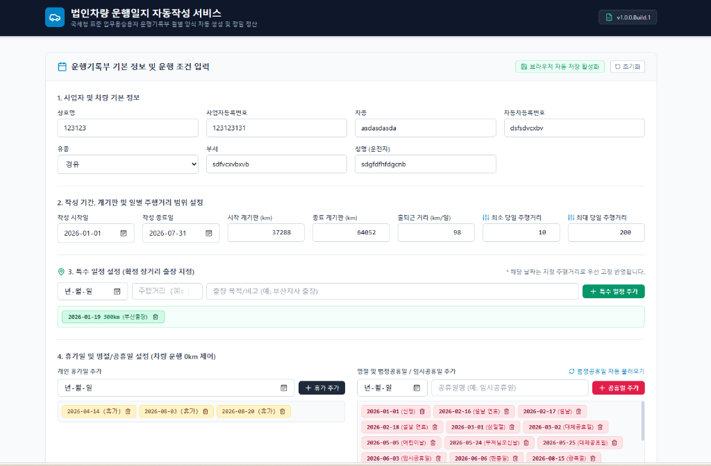

# 🚗 법인차량 운행일지 자동작성 서비스 (AutoLog Tax)

> **국세청 표준 업무용승용차 운행기록부 월별 양식 자동 생성 및 엑셀 다운로드 웹 서비스**
> 
> 🌐 **웹 서비스 바로가기**: [https://dragonrpa.github.io/AutoLog_Tax/](https://dragonrpa.github.io/AutoLog_Tax/)

---

## 📸 서비스 사용 화면 (User Interface Preview)

---

## 🌟 핵심 주요 기능 (Key Features)

1. **국세청 표준 양식 100% 일치 엑셀 다운로드 (`.xlsx`)**:
   * 제공된 국세청 서식과 동일한 헤더, 기본정보, 표 테두리, 수식, 노란색 하이라이트 셀(12번 업무용 사용거리, 13번 업무사용비율) 완벽 적용
   * 작성 기간에 맞춰 **월별 시트(`YYYY년MM월`)**로 자동 분할 생성
2. **정밀 수식 산출 및 업무사용비율 계산**:
   * **⑪ 과세기간 총주행 거리**: $\sum \text{⑦ 주행거리}$ (종료 계기판 - 시작 계기판 100% 일치)
   * **⑫ 과세기간 업무용 사용거리**: $\sum \text{⑨ 일반 업무용 잔여거리}$ (출퇴근 거리를 차감한 잔여 일반 업무용 거리 집계)
   * **⑬ 업무사용비율**: $\frac{\text{⑫ 과세기간 업무용 사용거리}}{\text{⑪ 과세기간 총주행 거리}} \times 100\%$
3. **출퇴근거리 60% / 40%(±15%) 정밀 제어 & 출퇴근 우선 확보 분배**:
   * 월별 평일 근무일의 **60%는 입력한 출퇴근 거리 100% 엄격 준수**
   * **40%는 출퇴근 거리의 $\pm 15\%$ 범위 내에서 자연스럽게 무작위 증감**
   * 전체 출퇴근 주행거리를 **우선 확보**한 후, 잔여 거리만을 일반 평일에 광범위 난수 분배
4. **특수 일정 (확정 장거리 지방 출장) 지정**:
   * 부산 지사 출장 등 확정 장거리 운행 기록을 날짜와 수치(예: `2026-01-19 300km (부산출장)`)로 지정
   * 해당 날짜는 지정 주행거리로 **우선 고정 반영**되며, 테이블 및 엑셀에 에메랄드 하이라이트 표기
5. **브라우저 로컬스토리지 (LocalStorage) 자동 저장 & 복원**:
   * 입력한 회사 정보, 계기판 수치, 개인 휴가일 및 임시공휴일이 실시간 자동 저장
   * 새로고침(`F5`)이나 웹 브라우저 재접속 시 이전 입력 데이터 100% 자동 유지

---

## 📖 사용법 매뉴얼 (User Manual)

### 1단계: 사업자 및 차량 기본 정보 입력
* **상호명**: 예: `(주)이렌컴`
* **사업자등록번호**: 예: `206-81-25423`
* **차종**: 예: `싼타페`
* **자동차등록번호**: 예: `122소2232`
* **유종**: `휘발유`, `경유`, `LPG`, `전기`, `하이브리드`, `수소` 선택
* **부서 및 성명**: 운전자 및 담당 부서 입력 (예: `신규영업팀` / `차승후`)

### 2단계: 작성 기간, 계기판 및 주행거리 제어 범위 입력
* **작성 시작일 / 종료일**: 작성하고자 하는 시작일과 종료일 지정 (과세기간 1년 자동 표기)
* **시작 계기판 거리 (km)**: 운행 시작 시점의 계기판 수치 (예: `37288`)
* **종료 계기판 거리 (km)**: 운행 완료 시점의 계기판 수치 (예: `64052`)
* **출퇴근 거리 (km/일)**: 평일 일별 왕복 출퇴근 거리 (예: `98`)
* **최소/최대 당일 주행거리**: 일별 주행거리의 상/하한 한계선 설정 (예: 최소 `10km` / 최대 `200km`)

### 3단계: 특수 일정 (확정 장거리 출장) 설정
* **날짜, 주행거리, 출장 목적** 입력 후 `[+ 특수 일정 추가]` 클릭
* 예: `2026-01-19` | `300km` | `부산출장` ➔ 등록 시 1월 19일 주행거리가 300km로 고정 반영

### 4단계: 휴가일 및 명절/공휴일 설정 (운행 0km 제어)
* **개인 휴가일**: 휴가 날짜 선택 후 `[+ 휴가 추가]` 클릭 (해당 일자 차량 운행 0km 및 휴가 표기)
* **법정공휴일**: `[⚡ 법정공휴일 자동 불러오기]` 클릭 시 해당 연도 신정, 설날, 추석, 삼일절, 광복절 등 100% 자동 등록
* **임시공휴일**: 날짜 및 공휴일명 입력 후 `[+ 공휴일 추가]` 클릭 (예: `2026-06-03 (임시공휴일)`)

### 5단계: 작성 및 엑셀 내려받기
1. **`[작성]` 버튼 클릭**:
   * 하단에 월별 시트 탭(`2026년01월`, `2026년02월`...)이 생성되며, 각 월의 운행기록부 데이터를 화면에서 실시간 검증
2. **`[내려받기]` 버튼 클릭**:
   * 국세청 제출용 정식 `.xlsx` 엑셀 파일 다운로드
   * 엑셀 파일 내부에 월별 시트가 분할되어 생성되며, 12번(업무용 사용거리) 및 13번(업무사용비율) 노란색 셀 수식 연동 확인

---

## 🛠️ 기술 스택 (Tech Stack)

* **Frontend Framework**: Next.js 15 (App Router, React 19, TypeScript)
* **Styling**: Tailwind CSS (전사 레이아웃 표준 가이드라인 준수)
* **Excel Engine**: `exceljs` (국세청 양식 100% 동일 서식 재현)
* **Deployment & CI/CD**: GitHub Actions static export ➔ GitHub Pages 배포

---

## 📄 릴리즈 노트 (Release Notes)

상세 변경 이력은 [RELEASE_NOTES.md](./RELEASE_NOTES.md)에서 확인하실 수 있습니다.

* **v1.0.0.Build.11**: 출퇴근 60% 엄격준수/40% 가변(±15%) 및 출퇴근 우선확보 분배 알고리즘 구현
* **v1.0.0.Build.10**: 잔여 일반 업무용 거리 집계(⑫) 및 업무사용비율(⑬ = ⑫/⑪ * 100%) 수식 적용
* **v1.0.0.Build.9**: 광범위 난수 분산, 최소/최대 주행거리 제어 및 특수 일정(장거리 출장) 기능 구축
* **v1.0.0.Build.7**: 브라우저 LocalStorage 자동 저장 & 복원 파이프라인 구축
